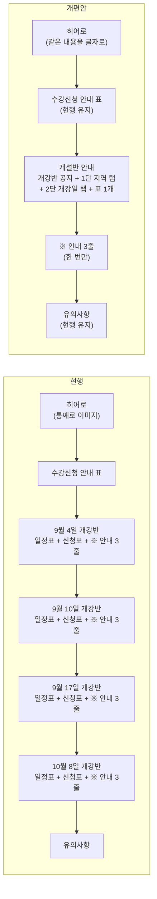
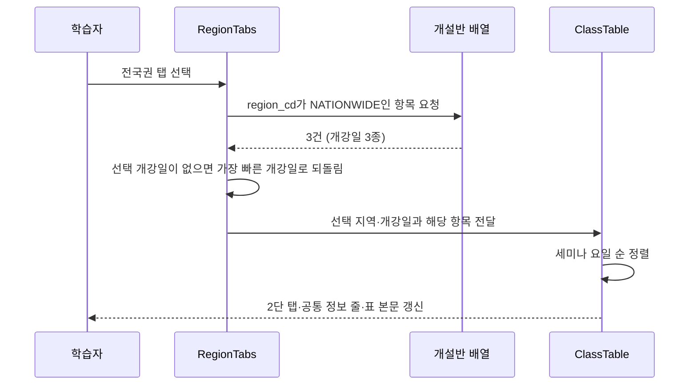

# 사회복지현장실습 안내 페이지 개편 설계

대상 페이지: `https://www.baeron.com/corp/new/practice_socialwork.asp`

## 1. 배경과 문제 정의

### 1.1 해결하려는 문제

개설반 정보를 확인하려면 스크롤이 지나치게 길다. 학습자가 자기 조건에 맞는 반을 찾기까지 화면을 여러 번 넘겨야 한다.

### 1.2 현황 측정

2026년 8월 20일 기준 운영 중인 페이지에서 확인한 값이다.

| 항목 | 측정값 |
|------|--------|
| 실제 개설반 수 | 10개 |
| 개설반을 담고 있는 표 개수 | 8개 (개강반별 일정표 4 + 신청표 4) |
| 개강반 블록(h3 단위) | 4개 |
| 행이 1개뿐인 블록 | 1개 (9월 10일 개강반) |
| 정렬·필터 기능 | 없음 |
| 잔여석 표시 | 없음 (주석에 데이터는 존재) |

핵심은 **개설반 10개를 보여주기 위해 표 8개를 세로로 쌓고 있다**는 점이다. 9월 10일 개강반은 개설반이 1개뿐인데도 제목·일정표·신청표 한 세트를 온전히 차지한다.

### 1.3 개설반 구성

| 개강일 | 개설반 수 | 수도권 | 전국권 |
|--------|-----------|--------|--------|
| 9월 4일 | 5 | 4 | 1 |
| 9월 10일 | 1 | 1 | 0 |
| 9월 17일 | 2 | 1 | 1 |
| 10월 8일 | 2 | 1 | 1 |
| 합계 | 10 | 7 | 3 |

### 1.4 함께 발견한 문제

개편 과정에서 스크롤 외에 세 가지를 추가로 확인했다.

| 번호 | 문제 | 근거 | 이번 범위 |
|------|------|------|-----------|
| A | 9월 4일 개강반에 화면상 완전히 동일한 행이 2개 존재 | 지역·요일·시간·수강료·세미나 3회 날짜가 모두 같음. 실제로는 정원 소진율만 다른 별개 반 | 임시 대응 (§6.1) |
| B | 정원·신청자 수 데이터가 있는데 화면에 노출되지 않음 | 신청표 각 행에 `<!-- 30 >= 23 -->` 형태의 주석으로 정원과 신청자 수가 기록되어 있음 | 노출하지 않기로 결정 (§6.2) |
| C | 비로그인 상태에서 신청 버튼이 막다른 길 | `href="javascript:alert('로그인후 이용할 수 있습니다.');"` - 안내만 하고 로그인 경로를 제공하지 않음 | 포함 (§4.3) |

## 2. 목표와 비목표

### 2.1 목표

- 개설반 영역의 세로 길이를 줄여 한 화면에서 비교 가능하게 한다.
- 학습자가 가장 먼저 확정하는 조건(실습기관 소재지)을 진입점으로 삼는다.
- 학기 교체 시 담당자가 편집할 지점을 한 곳으로 모은다.

### 2.2 비목표 (이번 개편 범위 밖)

아래 항목은 문제로 확인했으나 스크롤 길이와 직접 관련이 없어 제외한다. 후속 과제로 §7에 남긴다.

- 문서 인코딩 (`euc-kr`)
- 상단 "수강신청 안내" 표 (수강자격·기관실습비·실습기관·제출서류·안내서) - 현행 유지
- 유의사항 영역 - 현행 유지

## 3. 설계 결정

### 3.1 묶는 기준: 지역

개설반 10개를 **실습기관 소재지(수도권 / 전국권)** 로 묶어 탭 2개로 만든다.

근거는 세 가지다.

1. 학습자가 가장 먼저 확정하는 조건이 "내 실습기관이 어디에 있는가"다. 개강일은 그다음 선택이다.
2. 지역이 정해지면 수강료가 확정된다. 수도권 300,000원, 전국권 400,000원으로 예외가 없다.
3. 개강일을 축으로 잡으면 탭이 4개가 되고, 학습자는 자기가 어느 개강일에 해당하는지 모르는 상태로 들어오므로 탭을 하나씩 열어봐야 한다.

### 3.2 기각한 대안

| 대안 | 기각 사유 |
|------|-----------|
| 개강일 단독 탭 (1단을 개강일로) | 학습자가 진입 시점에 자기 개강일을 모른다. 지역을 먼저 좁히지 않으면 탭마다 수강료가 섞여 비교가 안 된다. 개강일은 §3.3의 2단으로 채택했다 |
| 탭 없이 필터 칩 + 통합표 | 스크롤 절감 효과는 가장 크나, 지역별 수강료 차이를 표 안에서 반복 표기해야 하고 초기 상태(전체 10행)가 여전히 길다 |
| 구법·신법 탭 | 10개 반 전부가 구법·신법 공통 대상이라 분기 기준이 되지 못한다 |

### 3.3 탭 안 구조: 개강일 2단 탭

탭 하나에는 개강일이 서로 다른 반이 섞인다. 이때 **개강일에 종속된 값을 행마다 반복하면 정작 반끼리 다른 값이 묻힌다.**

수도권의 9월 4일 개강 4개 반은 개강일·수강기간·실습가능기간이 모두 같고, 실제로 다른 것은 세미나 요일·시간과 세미나 3회 날짜뿐이다.

따라서 개강일을 **2단 탭**으로 올린다. 화면에는 한 번에 한 개강일만 보인다.

| 계층 | 담당 | 표기 |
|------|------|------|
| 1단 탭 | 실습기관 소재지 | 수도권 / 전국권 · 소재지 범위 부연 |
| 2단 탭 | 개강일 | 9월 4일 개강 / 9월 10일 개강 … |
| 공통 정보 줄 | 선택한 지역과 개강일에 종속된 값 | 학기, 수강기간, 실습가능기간, 수강료 |
| 표 | 반마다 다른 값 | 세미나 요일·시간, 대상, 세미나 3회 날짜, 신청 |

행에는 접기·펼치기를 두지 않는다(모바일은 §3.4). 한 개강일 안에서 반끼리 비교할 때 클릭이 필요 없다.

#### 2단 탭 규칙

| 항목 | 규칙 |
|------|------|
| 배열 | 개강일 오름차순 |
| 기본 선택 | 그 지역의 가장 빠른 개강일 |
| 1단 전환 시 | 그 지역의 가장 빠른 개강일로 되돌린다 |
| 폭 | 탭이 줄 폭을 균등하게 나눠 갖는다. 1단도 같다(지역 2개이므로 반씩) |
| 반 개수 | 표기하지 않는다. 선택한 개강일의 반 수는 바로 아래 표의 행 수로 보인다 |
| 학기 | 그 지역의 개강일이 **두 학기 이상에 걸칠 때만** 탭에 학기를 붙인다. 한 학기뿐이면 모든 탭에 같은 값이 붙어 구분에 쓸모가 없다 |
| 마감 | 그 개강일의 반이 모두 마감이면 "마감"을 붙이고 탭을 흐리게 처리한다 |

화면에는 항상 한 지역·한 개강일만 나온다. 2단에 "전체"를 두어 개강일을 가로질러 비교하는 통로를 만드는 안을 검토했으나, 탭 하나가 다른 탭들과 성격이 달라지고(개강일이 아니다) 그 탭에서만 쓰이는 개강일 그룹 머리가 표에 한 겹 더 얹히므로 두지 않는다.

#### 1단 탭의 소재지 범위 부연

지역 이름만으로는 "내 실습기관이 어느 탭인가"를 판단할 수 없다. 수도권이 서울·경기·인천까지인지, 전국권이 섬과 산간지역을 포함하는지가 선택의 근거다.

따라서 범위를 **1단 탭 안 두 번째 줄**에 적는다. 탭을 고른 뒤 공통 정보 줄에서 확인하는 것은 순서가 뒤집힌 것이다.

| 탭 | 부연 |
|----|------|
| 수도권 | 서울, 경기, 인천 소재 |
| 전국권 | 전국(섬 및 산간지역 제외) 소재 |

문구는 현행 페이지의 "수강신청 안내 > 실습기관" 항목(`◆ 수도권(서울, 경기, 인천 소재 실습기관)`, `◆ 전국반(전국 소재 실습기관/섬 및 산간지역 제외)`)을 탭 폭에 맞게 줄인 것이다. 이 값이 탭에 있으므로 공통 정보 줄에서는 뺀다.

### 3.4 행 상세 표시 (모바일): 요약 후 펼치기

데스크톱과 모바일이 요구하는 것이 서로 반대다.

| | 사용 방식 | 필요한 것 |
|---|---|---|
| 데스크톱 | 여러 반을 나란히 놓고 비교 | 한 화면에 값이 전부 보일 것 |
| 모바일 | 위에서 아래로 훑으며 후보를 좁힘 | 한 반이 차지하는 높이가 작을 것 |

컬럼을 모바일에서 그대로 펼치면 표가 카드로 바뀌면서 컬럼 하나가 카드 안의 한 줄이 된다. 이는 이번 개편이 해결하려는 문제(§1.1)를 모바일에서 다시 만들어내는 것이다.

따라서 모바일에서는 카드 앞면에 선택에 필요한 최소 정보만 두고 나머지는 펼쳐서 본다. 개강일·수강기간·실습가능기간은 2단 탭과 공통 정보 줄이 담당하므로 카드에 다시 쓰지 않는다.

| 위치 | 항목 |
|------|------|
| 1단 탭 | 실습기관 소재지와 그 범위 |
| 2단 탭 | 개강일 |
| 공통 정보 줄 | 학기, 수강기간, 실습가능기간, 수강료 |
| 카드 앞면 (항상 보임) | 세미나 요일·시간, 신청 버튼 |
| 펼쳤을 때 | 대상, 오리엔테이션, 중간평가회, 최종평가회 |

앞면은 **1줄**이다. 왼쪽에 세미나 요일·시간, 오른쪽에 신청 버튼을 둔다.

데이터는 데스크톱과 동일하며 노출 단계만 다르다. 모바일 전용 데이터나 별도 화면을 만들지 않는다.

### 3.5 모바일 기타 규칙

| 항목 | 규칙 | 이유 |
|------|------|------|
| 펼치기 컨트롤 | 글자 없는 아이콘(원형 셰브런). 대체 텍스트는 "세미나 3회 일정 보기" | "일정 ▾" 처럼 글자를 넣으면 카드 앞면에 줄바꿈이 생겨 카드 높이가 들쭉날쭉해짐 |
| 터치 영역 | 신청 버튼은 최소 44px 높이. 펼치기 버튼은 카드 앞면을 1줄로 유지하기 위해 32px 아이콘으로 두되, 히트 영역을 44px로 넓힘 | 손가락 조작 정확도 |
| 마감 표시 | 흐리게 처리만으로는 구분되지 않으므로 "신청마감" 문구를 카드 안에 유지 | 명암 대비만으로 상태를 전달하지 않음 |
| 탭 고정 | 스크롤 시 탭을 상단에 고정 | 탭 전환을 위해 위로 되돌아가지 않게 함 |
| 가로 스크롤 | 발생시키지 않음 | 표를 카드로 바꾸는 이유 |
| 2단 탭 줄바꿈 | 폭이 좁으면 여러 줄로 감싼다. 가로 스크롤 대신 줄바꿈을 쓴다 | 390px에서 개강일 4개가 한 줄에 들어가지 않음 |
| 공통 정보 줄 | 한 줄로 늘어놓지 않고 항목마다 줄을 나누되, **라벨 열을 맞춘다**(라벨 열 폭은 가장 긴 라벨 기준) | 폭이 좁으면 학기 칩이 첫 줄을 나눠 쓰면서 `수강기간`과 `실습가능기간`의 시작 지점이 어긋난다 |

## 4. 구조 설계

### 4.1 페이지 구조 변경

표 8개와 소제목 4개가 2단 탭과 표 1개로 줄어든다. 화면에는 한 번에 한 지역·한 개강일만 보이므로 표는 항상 4행 이하다.

앞뒤 섹션은 현행을 유지한다. 다만 개강반 표마다 똑같이 붙어 있던 **※ 안내 3줄**(구법 온라인 세미나 / 신법 오프라인 세미나 / 협회 운영안)은 표가 하나로 합쳐졌으므로 표 아래 한 번만 둔다.

개강반 공지도 마찬가지다. 현행은 개강반 블록 4개 앞에 `<!--div class="tit_messa">▼ ▼ ▼ 10월 6일 개강반부터 간접실습 불가 ▼ ▼ ▼</div-->` 를 각각 두고 **주석으로 켜고 끈다**. 즉 지금은 화면에 나오지 않으며, 켜려면 담당자가 네 곳의 주석을 동시에 풀어야 한다. 개편안에서는 개설반 안내 머리에 자리를 하나만 두고, 데이터의 `notice_txt` 를 채우면 뜨고 비우면 사라지게 한다.

수강신청 안내 표의 **실습기관** 행에서는 소재지 정의(`◆ 수도권(...)`, `◆ 전국반(...)`)를 뺀다. 같은 값이 바로 아래 1단 탭에 있기 때문이며(§3.3), 대신 탭을 가리키는 한 줄과 한국사회복지사협회 기관 목록 링크만 남긴다.

**히어로는 이미지를 글자로 바꾼다.** 현행 히어로(`social_pc1_2309.png`)는 구법 120시간 / 신법 160시간, 세미나 진행 방식, 교육장 주소 같은 핵심 안내를 통째로 이미지에 담고 있고 대체텍스트가 `하단 참조`뿐이다. 화면 낭독기로는 읽히지 않고 검색에도 잡히지 않는다. 배치와 문구는 현행 그대로 두고 마크업만 글자로 옮긴다.

| 요소 | 내용 |
|------|------|
| 제목 | 실습 가능 지역 전국 확대! 사회복지 현장실습 (`h1`) |
| 구법 학습자 | 2020년 이전부터 이수 시작 · 현장실습 120시간 · 온라인 강의 세미나 |
| 신법 학습자 | 2020년부터 이수 시작 · 현장실습 160시간 · 오프라인 출석 세미나 · 교육장 주소와 지도 링크 |
| 링크 | 사회복지현장실습 자주하는 질문 바로가기 (`/customer/cs_faq.asp?gubun=6`) |
| 맺음 | 배론은 보건복지부와 한국사회복지사협회 지침에 따라 운영하고 있습니다 |

색도 현행에서 측정한 값을 쓴다. 이 띠는 본문 팔레트(§4.5)와 따로 노는 브랜드 영역이므로 라이트·다크 어느 쪽에서도 값이 바뀌지 않는다.

| 요소 | 값 |
|------|-----|
| 띠 배경 | `#188a6e` |
| 제목 알약 | 바탕 `#48ebb5` / 글자 `#0f3a2d` |
| 큰 제목 | 흰색 |
| 카드 바탕 | `#ffeee5` (살구) / 글자 `#333333` |
| 카드 제목 줄 | `#fddecd` (한 톤 진한 살구) |
| 교육장 줄 | `#4d4d4d`, 위치 버튼은 흰 바탕 `#333333` 글자 |
| 자주하는 질문 버튼 | 바탕 `#2a2333` / 글자 `#48ebb5` |

카드 두 장은 마주 보는 아래쪽 모서리만 각지게 두어 한 벌로 읽히게 한다(현행과 같다). 좁은 폭에서 위아래로 쌓이면 이 규칙이 의미가 없으므로 네 모서리를 모두 둥글게 되돌린다.

다만 맺음 문구는 현행이 녹색 띠 위에 `#333333`을 얹어 명도 대비가 2.4:1에 그친다. 개편안은 같은 계열에서 한 단계 어두운 `#1c2b26`을 써서 대비를 3.6:1로 올렸다. 눈에 보이는 색은 거의 같다.

한글은 어절 안에서 줄이 갈리면 읽기 어렵다. 현행은 ` ` 를 손으로 넣어 막고 있는데, 개편안은 `word-break:keep-all` 로 규칙화해 폭이 바뀌어도 어절이 쪼개지지 않게 한다.

문체는 현행을 따른다. 수강신청 안내 표는 **명사형 종결**(`본인이 직접 납부함`, `게시물 참조`, `~에 제출`)이고, 유의사항은 **합쇼체**(`~바랍니다`, `~처리됩니다`)다. 표를 옮겨 적으면서 문장체로 고쳐 쓰면 같은 페이지 안에서 문체가 갈린다.

### 4.2 컬럼 구성

2단 탭 아래 공통 정보 줄은 선택한 지역과 개강일에 종속된 값을 담는다. 실습기관 소재지는 1단 탭이 담당하므로 여기에 다시 쓰지 않는다(§3.3).

| 항목 | 표기 |
|------|------|
| 학기 | 학기 26년 2학기 |
| 수강기간 | 수강기간 26.09.04(금) ~ 26.12.17(목) |
| 실습가능기간 | 실습가능기간 26.09.14(월) ~ 26.12.02(수) |
| 수강료 | 300,000원 - 이 줄에서 가장 큰 글자(22px)로 두고 옅은 주황 알약 안에 넣는다. 지역을 고르는 근거이기 때문이다 |

세 항목은 모두 `라벨 + 값` 형식으로 통일한다. 학기만 칩으로 만들면 라벨 없이 떠 있는 표시가 되어 어디에 걸리는 값인지 읽히지 않는다. 알약을 쓰는 것은 수강료 하나뿐이며, 그것이 이 줄의 초점이라는 신호다.

기간은 연도를 두 자리로 줄여 `26.09.04(금)` 로 쓴다. 표의 세미나 3회 날짜(`09.04(금)`)와 같은 형식이며, 연도가 넘어가는 개강반(10월 8일 개강은 종료가 2027년)이 있으므로 연도를 지우지는 않는다.

표 컬럼은 다음 6개다. 표 안에서는 세미나 요일 순으로 정렬한다.

| 순서 | 컬럼 | 내용 | 예시 |
|------|------|------|------|
| 1 | 세미나 | 요일과 시간대 | 금요일 14~16시 |
| 2 | 대상 | 구법·신법 구분 | 구법,신법 |
| 3 | 오리엔테이션 | 월.일(요일) | 09.04(금) |
| 4 | 중간평가회 | 월.일(요일) | 10.23(금) |
| 5 | 최종평가회 | 월.일(요일) | 12.11(금) |
| 6 | 신청 | 신청 버튼 또는 마감 표시 | 신청하기 / 신청마감 |

**대상** 컬럼은 현행 신청표에 있던 항목이다. 2026학년도 2학기 10건은 모두 `구법,신법` 이라 값이 같지만(§3.2에서 이 값을 탭 기준으로 쓰지 않기로 한 이유이기도 하다), 반 단위 속성이므로 행에 둔다. 학기에 따라 한쪽만 받는 반이 생기면 그때 값이 갈린다. 모바일에서는 카드 앞면을 1줄로 유지해야 하므로 펼쳤을 때 보인다.

### 4.3 상태 처리

| 상태 | 판정 조건 | 화면 처리 |
|------|-----------|-----------|
| 신청 가능 | `closed_flag = false` | 신청 버튼 활성 |
| 마감 | `closed_flag = true` | "신청마감" 표시, 버튼 비활성, 행 흐리게. **목록에서 숨기지 않는다** |
| 비로그인 | 로그인 세션 없음 | 로그인 페이지로 이동하되 복귀 주소를 함께 전달 |
| 해당 지역 개설반 없음 | 필터 결과 0건 | 빈 표 대신 안내 문구와 다른 탭 유도 |

마감된 반을 숨기지 않는 이유는, 사라진 반을 두고 "폐강되었는지" 문의가 들어오는 것을 막기 위해서다. 현행 페이지도 마감 반을 표시하고 있으므로 동작이 바뀌지 않는다.

비로그인 처리는 현행의 `alert()` 후 아무 동작 없음을 대체한다. 안내 문구만 띄우고 학습자가 스스로 로그인 메뉴를 찾아 돌아오게 하는 것은 신청 이탈 지점이다.

### 4.4 컴포넌트

| 컴포넌트 | 책임 | 입력 | 출력 |
|----------|------|------|------|
| `RegionTabs` | 지역 선택 상태 관리, 탭별 소재지 범위 부연 | 지역 정의 | 선택된 지역 코드 |
| `DateTabs` | 선택 지역의 개강일 목록 렌더, 개강일 선택 상태 관리, 마감 개강일 표시 | 선택 지역의 개설반 배열 | 선택된 개강일 |
| `CommonInfo` | 선택한 지역·개강일의 공통 값 표시 | 지역, 개강일 대표 항목 | 공통 정보 줄 |
| `ClassTable` | 선택한 지역·개강일의 개설반 렌더, 세미나 요일 순 정렬 | 개설반 배열, 선택 지역, 선택 개강일 | 표 본문 |
| `ApplyCell` | 신청 버튼 상태 결정 | 마감 여부, 로그인 여부 | 신청 / 마감 / 로그인필요 |

각 컴포넌트는 상위에서 받은 값만으로 렌더되며 서로를 직접 참조하지 않는다. `ApplyCell`은 신청 버튼 상태 규칙을 단독으로 소유하므로, 상태가 늘어도 수정 지점이 한 곳이다.

### 4.5 색과 글꼴

개편안은 배치만 바꾼다. 색과 글꼴은 새로 만들지 않고 현행 페이지에서 측정한 값을 그대로 쓴다. 개설반 영역만 색이 달라지면 같은 페이지 안에서 이질적으로 보이기 때문이다.

| 쓰임 | 값 | 현행에서의 출처 |
|------|-----|-----------------|
| 페이지 배경 | `#ffffff` | `body` 배경 |
| 본문 · 보조 · 흐린 글자 | `#333333` · `#4d4d4d` · `#808080` | 본문, 셀 텍스트 |
| 강조(녹색) | `#0d855d` · `#0b7350` | 수강신청 안내 표 머리 칸 배경, 일정표 머리 글자 |
| 표 머리 띠 | `#d5f2e9` | 개강반 일정표·신청표 머리 행 |
| 신청 버튼 | `#d94100` 알약 | 현행 `신청하기 ▶` 버튼 |
| 수강료 금액 | `#d94100` 글자 + 7% 농도 배경 알약 | 위 버튼 색을 재사용 |
| 마감 표시 | `#ebebeb` / `#808080` | 현행 `신청마감` |
| 셀 구분선 | `#e1e1e1` | 표 테두리 |
| 글꼴 | Pretendard | `css/new/reset.css` 의 `font-family:'Pretendard', sans-serif` |

글꼴은 한 벌만 쓰고 제목과 본문을 굵기로만 구분한다. 목업은 jsDelivr 로 Pretendard 를 불러오며, 차단되는 환경에서는 Apple SD Gothic Neo · 맑은 고딕으로 내려간다.

글자 크기는 다섯 단만 쓴다. 단이 늘어나면 같은 층위의 글이 화면마다 달라 보인다.

| 크기 | 쓰임 |
|------|------|
| 12px | 탭 부연, 배지 |
| 13px | 표 머리, ※ 안내, 괄호 부연, 설명 패널 |
| 14px | 표 본문, 버튼, 2단 탭, 유의사항 |
| 15px | 페이지 본문 |
| 16px | 1단 탭 이름, 수강신청 안내 표 |
| 22px | 수강료 금액 |

수강신청 안내 표만 16px인 것은 현행 값이 그렇기 때문이다. 개설반 표는 컬럼이 6개라 같은 크기로 올리면 날짜 칸이 좁아지므로 14px를 유지한다.

섹션 제목은 `clamp(25px, 3.4vw, 32px)` 를 쓴다. 페이지 제목은 히어로가 담당한다(§4.1).

정렬은 두 가지를 지킨다.

- **왼쪽 끝을 하나로.** 섹션 제목과 표 상자의 왼쪽 끝이 같은 선에 놓인다. 제목 앞 강조 막대는 글자 옆이 아니라 위에 두는데, 옆에 두면 제목만 막대 너비만큼 밀리기 때문이다. 상자 안쪽 여백은 가로 18px 로 통일한다(2단 탭 줄, 공통 정보 줄, 안내 표 셀).
- **표 컬럼 폭 고정.** `table-layout:fixed` 로 세미나 24% · 대상 12% · 날짜 3칸 각 14% · 신청 22% 를 준다. 자동 폭에 맡기면 글자 수가 많은 세미나 칸만 넓어져 날짜 3칸이 한쪽으로 몰린다.

그림자는 쓰지 않는다. 현행 페이지가 테두리만으로 표를 구분하므로, 그림자를 넣으면 개설반 영역만 떠 보인다.

색 토큰은 라이트/다크 두 벌로 두되, 위 값은 라이트 기준이다. 다크는 같은 색상환에서 명도만 바꾼 값이며 현행 페이지에는 없는 상태다.

목업 상단의 설명 패널만 이 팔레트를 따르지 않는다. 실제 페이지에 들어가지 않는 요소라 본문과 구별되어야 하기 때문이다.

## 5. 데이터 설계

### 5.1 단일 데이터 배열

개설반 10개를 배열 하나로 분리한다. 학기가 바뀌면 담당자는 이 배열만 교체한다. 현행처럼 `div_20260206`부터 `div_20260209`까지 블록을 복사하고 그 안의 날짜를 일일이 고칠 필요가 없어진다.

### 5.2 항목 구조

필드명은 전사 표준(`01-database-naming-rules.md`)의 접미사 규약을 따른다.

| 필드 | 타입 | 설명 | 예시 |
|------|------|------|------|
| `class_id` | 문자열 | 개설반 식별자 | `2026-2-0904-A` |
| `region_cd` | 문자열 | 지역 코드 | `METRO` / `NATIONWIDE` |
| `start_dt` | 날짜 | 개강일 | `2026-09-04` |
| `course_end_dt` | 날짜 | 수강 종료일 | `2026-12-17` |
| `practicum_start_dt` | 날짜 | 실습가능 시작일 | `2026-09-14` |
| `practicum_end_dt` | 날짜 | 실습가능 종료일 | `2026-12-02` |
| `term_nm` | 문자열 | 학기 | `26년 2학기` |
| `target_nm` | 문자열 | 대상 (구법·신법 구분) | `구법,신법` |
| `seminar_day_nm` | 문자열 | 세미나 요일 | `금요일` |
| `seminar_time_nm` | 문자열 | 세미나 시간대 | `14~16시` |
| `ot_dt` | 날짜 | 오리엔테이션 | `2026-09-04` |
| `midterm_dt` | 날짜 | 중간평가회 | `2026-10-23` |
| `final_dt` | 날짜 | 최종평가회 | `2026-12-11` |
| `tuition_amt` | 정수 | 수강료 | `300000` |
| `closed_flag` | 불리언 | 마감 여부 | `false` |

지역 코드는 표준(`01` §6)에 따라 대문자와 밑줄만 사용한다.

배열 바깥에는 `notice_txt`(개강반 공지, 예: `10월 6일 개강반부터 간접실습 불가`) 하나만 둔다.

**학기는 배열 바깥에 두지 않는다.** 한 화면에 걸린 개설반이 모두 같은 학기라는 보장이 없기 때문이다. 개강일이 학기 경계를 넘으면(예: 10월 개강반이 다음 해 1학기로 잡히는 경우) 학기가 갈린다. 따라서 `term_nm`은 개설반 항목마다 갖는다(§5.2). `notice_txt`가 빈 값이면 공지 줄을 감춘다. 현행 페이지가 이 공지를 주석으로 막아둔 상태이므로 2026학년도 2학기 데이터에서는 빈 값이다(§4.1).

정원·신청자 수·잔여석 같은 수치는 저장하지 않는다(§6.2). 화면에 필요한 판정이 마감 여부 하나뿐이므로 불리언으로 충분하다.

### 5.3 파생 값

화면에 표시되는 다음 값은 저장하지 않고 계산한다.

- 개설반 유무 = 해당 `region_cd` 항목 수가 0인지
- 수강료 안내줄 = 해당 지역 항목의 `tuition_amt`
- 2단 탭 목록 = 선택 지역 항목의 `start_dt` 중복 제거 후 오름차순
- 개강일 탭 마감 표시 = 해당 `start_dt` 항목이 전부 `closed_flag = true`
- 공통 정보 줄 값 = 선택한 `start_dt` 첫 항목의 `course_end_dt`, `practicum_start_dt`, `practicum_end_dt`

### 5.4 탭 전환 흐름

탭 전환은 표 본문만 다시 그린다. 페이지 이동이나 서버 재요청이 없다.

### 5.5 공통 정보 줄 전제의 검증

공통 정보 줄에 수강기간·실습가능기간을 올리는 것은 **같은 개강일이면 그 값이 항상 같다**는 전제 위에 있다. 현행 10건으로 확인한 결과, 두 지역 7개 개강일 모두에서 값이 단일했다.

| 지역 | 개강일 수 | 공통값이 단일한 개강일 |
|------|---------|------------------------------|
| 수도권 | 4 | 4 |
| 전국권 | 3 | 3 |

전제가 깨지는 데이터(같은 개강일인데 실습가능기간이 다른 반)가 들어오면 공통 정보 줄 값이 틀리게 된다. 데이터 교체 시 이 조건을 확인한다.

## 6. 미해결 이슈

### 6.1 중복 개설반 구별자 부재

9월 4일 개강반의 두 항목이 화면에 표시되는 모든 값이 같다.

| 항목 | 지역 | 세미나 | 오리엔테이션 | 중간평가회 | 최종평가회 | 수강료 | 정원 대비 신청 |
|------|------|--------|--------------|------------|------------|--------|----------------|
| 1 | 수도권 | 금요일 14~16시 | 09.04(금) | 10.23(금) | 12.11(금) | 300,000원 | 23 / 30 |
| 2 | 수도권 | 금요일 14~16시 | 09.04(금) | 10.23(금) | 12.11(금) | 300,000원 | 4 / 30 |

(위 표의 마지막 열은 문제를 설명하기 위한 현행 원본 값이며, 개편 후 데이터에는 마감 여부만 남는다.)

학습자는 두 반의 차이를 알 수 없고, 무엇을 기준으로 선택해야 하는지 판단할 근거가 없다.

이것은 화면 설계로 해결할 수 없는 데이터 문제다.

**2026-08-21 확인**: 같은 날짜·같은 시간대의 세미나라도 **담당 교수가 다른 경우**가 있다는 것이 두 반이 갈리는 실제 기준이다. 다만 현행 데이터에는 교수명이 화면 항목으로 들어 있지 않다. 운영 부서에 개설반 명칭 표기 자체를 수정해 달라고 요청하기로 했고, 그 결과가 나오면 표에 반영한다.

**이번 목업에서의 처리**: 임시로 넣었던 `1분반` / `2분반` 표기는 걷어냈다. 실제 구분 기준이 아닌 표기를 화면에 남겨 두면 학습자가 그것을 선택 근거로 오해한다. 운영 부서의 수정 표기가 확정되면 세미나 칸에 그 값을 넣는다.

### 6.2 정원 수치 노출 범위

현행 페이지는 정원과 신청자 수를 주석으로만 두고 화면에 노출하지 않는다. 잔여석 표시는 신청을 촉진하는 효과가 있으나, 현행 10건의 잔여석은 7석에서 30석 사이로 대부분이 여유 있는 상태였다. 신청자가 거의 없는 반(잔여 28석, 30석)은 잔여석을 그대로 보여줄 경우 오히려 폐강 우려를 준다.

**결정**: 수치를 일절 노출하지 않는다. 화면에는 마감 여부만 표시하고, 데이터에도 `closed_flag` 불리언만 둔다(§5.2). 폐강 우려에 대한 대응은 유의사항의 기존 문구("개설 가능 인원 미달 시 폐강될 수 있으며")가 이미 담당한다.

잔여석 표시가 다시 필요해지면 `closed_flag`를 `remaining_cnt` 정수로 되돌리고 §4.3에 마감 임박 상태를 추가한다.

## 7. 후속 과제

이번 범위 밖이지만 확인된 항목이다. 별도 개편 단위로 다룬다.

| 항목 | 내용 | 영향 |
|------|------|------|
| 확대 차단 | 페이지 공통 헤더의 `viewport`에 `maximum-scale=1.0, user-scalable=no`가 선언되어 화면 확대가 막혀 있음. 이 사이트는 웹접근성 인증마크를 표시하고 있음 | 저시력 사용자가 본문을 확대할 수 없음 (WCAG 1.4.4) |
| 중복 `viewport` 태그 | 같은 문서에 `viewport` 메타 태그가 2개 선언되어 있음(하나는 `width=1400` 포함). 뒤에 오는 선언이 적용되므로 현재 렌더에는 문제가 없으나 의도가 불명확함 | 이후 편집 시 어느 쪽이 적용되는지 오해 소지 |
| 문서 인코딩 | `euc-kr` | 외부 도구 연동 시 변환 필요 |
| 마크업 위생 | 표 셀 안에 `<style>a{display:inline-block;}` 전역 선언, 제목 단계가 h2에서 h3을 거쳐 h5로 도약 | 다른 요소에 의도치 않은 영향 |

## 8. 검증 방법

검증은 Chrome 헤드리스로 실제 렌더를 캡처해 육안 확인한다. 헤드리스 창은 폭 500px 미만으로 줄지 않으므로, 모바일 폭은 페이지를 390px 폭 iframe에 넣어 확인한다.

목업은 원본 개설반 10건을 그대로 사용한다. 브라우저에서 다음을 육안으로 확인한다.

- 수도권 7건, 전국권 3건이 표의 행 수와 일치하는가
- 1단 탭 두 번째 줄에 소재지 범위가 나오고, 같은 문구가 공통 정보 줄에 중복되지 않는가
- 2단 탭이 개강일 오름차순이고, 표 안은 세미나 요일 순인가
- 1단·2단 탭이 각각 줄 폭을 균등하게 나눠 갖는가
- 히어로가 화면 폭을 꽉 채우고, 그 안의 내용은 본문과 같은 1000px 폭에 맞는가
- 히어로의 구법·신법 카드가 좁은 폭에서 위아래로 쌓이고, 제목이 어절 안에서 갈리지 않는가
- 섹션 제목과 표 상자의 왼쪽 끝이 한 선에 놓이는가
- 표 5개 컬럼의 폭이 고정되어 개강일을 바꿔도 흔들리지 않는가
- 첫 진입 시 가장 빠른 개강일(9월 4일)이 선택되어 있는가
- ※ 안내 3줄이 화면에 한 번만 나오는가
- `notice_txt`가 빈 값이면 개강반 공지 줄이 나오지 않고, 채우면 한 곳에만 나오는가
- 공통 정보 줄 맨 앞에 학기가 나오는가. 한 개강일의 `term_nm`을 다른 학기로 바꾸면 2단 탭에도 학기가 붙고, 되돌리면 사라지는가
- 수도권에서 9월 10일을 선택한 뒤 전국권으로 옮기면 9월 4일로 되돌아가는가 (전국권에는 9월 10일이 없음)
- 공통 정보 줄의 수강기간·실습가능기간이 그 개강일 모든 반에서 동일한가 (§5.5)
- 마감된 반(9월 4일 개강 수도권 일요일 09~11시)이 목록에 남아 있고 버튼이 비활성인가
- 수치(잔여석·정원·신청자 수)가 화면 어디에도 노출되지 않는가
- 1단 탭 전환 시 공통 정보 줄의 수강료가 300,000원과 400,000원으로 바뀌는가
- 개설반이 0건인 지역을 가정했을 때 안내 문구가 나오는가

모바일 폭(768px 이하)에서 추가로 확인한다.

- 표가 카드로 바뀌고 가로 스크롤이 생기지 않는가
- 2단 탭이 폭에 맞춰 줄바꿈되고 가로 스크롤이 생기지 않는가
- 카드 앞면이 1줄로 유지되는가 (세미나 / 신청)
- 펼치기 버튼으로 오리엔테이션·중간평가회·최종평가회가 나타나는가
- 마감된 반의 카드에 "신청마감"이 문구로 남아 있는가
- 스크롤 시 탭이 상단에 고정되는가

별도 자동화 테스트는 두지 않는다. 목업은 검토용 산출물이며 운영 코드가 아니다.

## 9. 산출물

| 경로 | 내용 |
|------|------|
| `docs/superpowers/specs/2026-08-20-사회복지현장실습-페이지-개편-design.md` | 이 문서 |
| `data/classes-2026-2.json` | 개설반 10건 데이터 |
| `mockup/practice-socialwork.html` | 동작하는 목업 (단일 파일, 원본) |
| `tools/make-artifact.py` | 목업에서 공유용 조각을 생성하는 스크립트 (파생물이 원본과 어긋나지 않게 함) |
