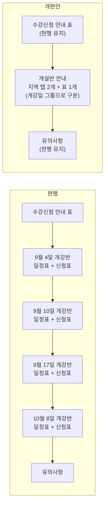
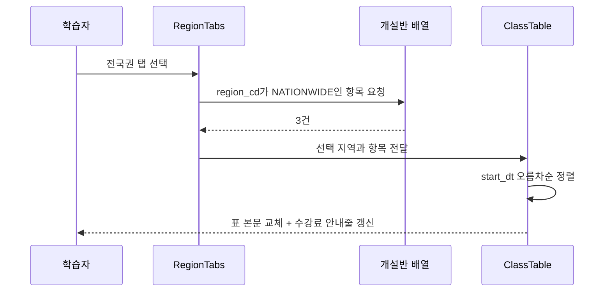

# 사회복지현장실습 안내 페이지 개편 설계

대상 페이지: `https://www.baeron.com/corp/new/practice_socialwork.asp`

## 1. 배경과 문제 정의

### 1.1 해결하려는 문제

개설반 정보를 확인하려면 스크롤이 지나치게 길다. 학습자가 자기 조건에 맞는 반을 찾기까지 화면을 여러 번 넘겨야 한다.

### 1.2 현황 측정

2026년 8월 20일 기준 운영 중인 페이지에서 확인한 값이다.

| 항목 | 측정값 |
|------|--------|
| 실제 개설반 수 | 10개 |
| 개설반을 담고 있는 표 개수 | 8개 (개강반별 일정표 4 + 신청표 4) |
| 개강반 블록(h3 단위) | 4개 |
| 행이 1개뿐인 블록 | 1개 (9월 10일 개강반) |
| 정렬·필터 기능 | 없음 |
| 잔여석 표시 | 없음 (데이터는 존재) |

핵심은 **개설반 10개를 보여주기 위해 표 8개를 세로로 쌓고 있다**는 점이다. 9월 10일 개강반은 개설반이 1개뿐인데도 제목·일정표·신청표 한 세트를 온전히 차지한다.

### 1.3 개설반 구성

| 개강일 | 개설반 수 | 수도권 | 전국권 |
|--------|-----------|--------|--------|
| 9월 4일 | 5 | 4 | 1 |
| 9월 10일 | 1 | 1 | 0 |
| 9월 17일 | 2 | 1 | 1 |
| 10월 8일 | 2 | 1 | 1 |
| 합계 | 10 | 7 | 3 |

### 1.4 함께 발견한 문제

개편 과정에서 스크롤 외에 세 가지를 추가로 확인했다.

| 번호 | 문제 | 근거 | 이번 범위 |
|------|------|------|-----------|
| A | 9월 4일 개강반에 화면상 완전히 동일한 행이 2개 존재 | 지역·요일·시간·수강료·세미나 3회 날짜가 모두 같음. 실제로는 정원 소진율만 다른 별개 반 | 임시 대응 (§6.1) |
| B | 정원·신청자 수 데이터가 있는데 화면에 노출되지 않음 | 신청표 각 행에 `<!-- 30 >= 23 -->` 형태의 주석으로 정원과 신청자 수가 기록되어 있음 | 포함 (§4.3) |
| C | 비로그인 상태에서 신청 버튼이 막다른 길 | `href="javascript:alert('로그인후 이용할 수 있습니다.');"` — 안내만 하고 로그인 경로를 제공하지 않음 | 포함 (§4.3) |

## 2. 목표와 비목표

### 2.1 목표

- 개설반 영역의 세로 길이를 줄여 한 화면에서 비교 가능하게 한다.
- 학습자가 가장 먼저 확정하는 조건(실습기관 소재지)을 진입점으로 삼는다.
- 학기 교체 시 담당자가 편집할 지점을 한 곳으로 모은다.

### 2.2 비목표 (이번 개편 범위 밖)

아래 항목은 문제로 확인했으나 스크롤 길이와 직접 관련이 없어 제외한다. 후속 과제로 §7에 남긴다.

- 히어로 영역의 이미지 내 텍스트 (`social_pc1_2309.png`, 대체텍스트가 "하단 참조")
- 문서 인코딩 (`euc-kr`)
- 상단 "수강신청 안내" 표 (수강자격·기관실습비·실습기관·제출서류·안내서) — 현행 유지
- 유의사항 영역 — 현행 유지

## 3. 설계 결정

### 3.1 묶는 기준: 지역

개설반 10개를 **실습기관 소재지(수도권 / 전국권)** 로 묶어 탭 2개로 만든다.

근거는 세 가지다.

1. 학습자가 가장 먼저 확정하는 조건이 "내 실습기관이 어디에 있는가"다. 개강일은 그다음 선택이다.
2. 지역이 정해지면 수강료가 확정된다. 수도권 300,000원, 전국권 400,000원으로 예외가 없다.
3. 개강일을 축으로 잡으면 탭이 4개가 되고, 학습자는 자기가 어느 개강일에 해당하는지 모르는 상태로 들어오므로 탭을 하나씩 열어봐야 한다.

### 3.2 기각한 대안

| 대안 | 기각 사유 |
|------|-----------|
| 개강일 4탭 (현행 구조를 탭으로만 전환) | 탭 수가 2배. 학습자가 진입 시점에 자기 개강일을 모르므로 탐색 비용이 그대로 남는다 |
| 탭 없이 필터 칩 + 통합표 | 스크롤 절감 효과는 가장 크나, 지역별 수강료 차이를 표 안에서 반복 표기해야 하고 초기 상태(전체 10행)가 여전히 길다 |
| 구법·신법 탭 | 10개 반 전부가 구법·신법 공통 대상이라 분기 기준이 되지 못한다 |

### 3.3 탭 안 구조 (데스크톱): 개강일 그룹 + 그룹 머리에 공통 정보

탭 하나에는 개강일이 서로 다른 반이 섞인다. 이때 **개강일에 종속된 값을 행마다 반복하면 정작 반끼리 다른 값이 묻힌다.**

수도권 탭의 9월 4일 개강 4개 반은 개강일·수강기간·실습가능기간이 모두 같고, 실제로 다른 것은 세미나 요일·시간과 세미나 3회 날짜뿐이다.

따라서 탭 안을 개강일 그룹으로 나누고, 그룹에 종속된 값은 **그룹 머리에 한 번만** 쓴다.

| 위치 | 항목 | 근거 |
|------|------|------|
| 그룹 머리 | 개강일, 수강기간, 실습가능기간, 그룹 내 반 개수 | 같은 개강일이면 항상 같은 값 (§5.5에서 검증) |
| 행 | 세미나 요일·시간, 분반 표기, 오리엔테이션, 중간평가회, 최종평가회, 잔여석, 신청 | 반마다 다른 값 |

행에는 접기·펼치기를 두지 않는다. 그룹 안에서 반끼리 비교할 때 클릭이 필요 없다.

이 구조는 원본 페이지의 개강반 블록 4개와 형태가 비슷해 보이지만 다르다. 원본은 블록마다 소제목 + 표 2개(일정표·신청표)를 두었고, 이 설계는 **표 하나 안의 그룹 머리 한 줄**이다. 그룹이 늘어도 표가 늘지 않는다.

**이 규칙은 데스크톱에만 적용한다.** 모바일에는 §3.4를 적용한다.

#### 감수하는 비용

전국권 탭처럼 그룹마다 반이 1개뿐이면 그룹 머리 하나에 행 하나가 붙는다. 행 수보다 그룹 머리가 많아 보일 수 있으나, 그룹 머리는 컬럼 2개(개강일·실습가능기간)를 대신하므로 순증가가 아니다.

### 3.4 행 상세 표시 (모바일): 요약 후 펼치기

데스크톱과 모바일이 요구하는 것이 서로 반대다.

| | 사용 방식 | 필요한 것 |
|---|---|---|
| 데스크톱 | 여러 반을 나란히 놓고 비교 | 한 화면에 값이 전부 보일 것 |
| 모바일 | 위에서 아래로 훑으며 후보를 좁힘 | 한 반이 차지하는 높이가 작을 것 |

컬럼을 모바일에서 그대로 펼치면 표가 카드로 바뀌면서 컬럼 하나가 카드 안의 한 줄이 된다. 이는 이번 개편이 해결하려는 문제(§1.1)를 모바일에서 다시 만들어내는 것이다.

따라서 모바일에서는 카드 앞면에 선택에 필요한 최소 정보만 두고 나머지는 펼쳐서 본다. 개강일 그룹 머리는 카드 위의 띠로 유지되므로, 개강일·수강기간·실습가능기간은 카드에 다시 쓰지 않는다.

| 위치 | 항목 |
|------|------|
| 그룹 띠 | 개강일, 수강기간, 실습가능기간, 반 개수 |
| 카드 앞면 (항상 보임) | 세미나 요일·시간, 분반 표기, 잔여석, 신청 버튼 |
| 펼쳤을 때 | 오리엔테이션, 중간평가회, 최종평가회 |

앞면은 **1줄**이다. 왼쪽에 세미나 요일·시간, 오른쪽에 잔여석과 신청 버튼을 둔다.

데이터는 데스크톱과 동일하며 노출 단계만 다르다. 모바일 전용 데이터나 별도 화면을 만들지 않는다.

### 3.5 모바일 기타 규칙

| 항목 | 규칙 | 이유 |
|------|------|------|
| 터치 영역 | 신청 버튼과 펼치기 버튼은 최소 44px 높이 | 손가락 조작 정확도 |
| 마감 표시 | 흐리게 처리만으로는 구분되지 않으므로 "신청마감" 문구를 카드 안에 유지 | 명암 대비만으로 상태를 전달하지 않음 |
| 탭 고정 | 스크롤 시 탭을 상단에 고정 | 탭 전환을 위해 위로 되돌아가지 않게 함 |
| 가로 스크롤 | 발생시키지 않음 | 표를 카드로 바꾸는 이유 |

## 4. 구조 설계

### 4.1 페이지 구조 변경

표 8개와 소제목 4개가 탭 2개와 표 1개로 줄어든다. 개강일 구분은 소제목·별도 표가 아니라 표 안의 그룹 머리 한 줄이 담당한다(§3.3).

### 4.2 컬럼 구성

탭 헤더 아래 고정 안내줄에 지역 설명과 수강료를 표기한다.

- 수도권 탭: "서울·경기·인천 소재 실습기관 · 수강료 300,000원"
- 전국권 탭: "전국 소재 실습기관(섬 및 산간지역 제외) · 수강료 400,000원"

그룹 머리는 표 전체 폭을 차지하며 다음을 담는다. 그룹은 개강일 오름차순으로 배열한다.

| 항목 | 예시 |
|------|------|
| 개강일 | 9월 4일 개강 |
| 수강기간 | 수강 09.04 ~ 12.17 |
| 실습가능기간 | 실습가능 09.14 ~ 12.02 |
| 반 개수 | 4개 반 |

표 컬럼은 다음 5개다. 그룹 안에서는 세미나 요일 순으로 정렬한다.

| 순서 | 컬럼 | 내용 | 예시 |
|------|------|------|------|
| 1 | 세미나 | 요일과 시간대, 분반 표기 | 금요일 14~16시 · 1분반 |
| 2 | 오리엔테이션 | 월.일(요일) | 09.04(금) |
| 3 | 중간평가회 | 월.일(요일) | 10.23(금) |
| 4 | 최종평가회 | 월.일(요일) | 12.11(금) |
| 5 | 신청 | 잔여석과 신청 버튼 | 잔여 7석 / 신청하기 |

### 4.3 상태 처리

| 상태 | 판정 조건 | 화면 처리 |
|------|-----------|-----------|
| 신청 가능 | `remaining_cnt > 5` | 잔여석 표시 + 신청 버튼 활성 |
| 마감 임박 | `0 < remaining_cnt <= 5` | 잔여석 강조 표시 + 신청 버튼 활성 |
| 마감 | `remaining_cnt <= 0` | "신청마감" 표시, 버튼 비활성, 행 흐리게. **목록에서 숨기지 않는다** |
| 비로그인 | 로그인 세션 없음 | 로그인 페이지로 이동하되 복귀 주소를 함께 전달 |
| 해당 지역 개설반 없음 | 필터 결과 0건 | 빈 표 대신 안내 문구와 다른 탭 유도 |

마감된 반을 숨기지 않는 이유는, 사라진 반을 두고 "폐강되었는지" 문의가 들어오는 것을 막기 위해서다. 현행 페이지도 마감 반을 표시하고 있으므로 동작이 바뀌지 않는다.

비로그인 처리는 현행의 `alert()` 후 아무 동작 없음을 대체한다. 안내 문구만 띄우고 학습자가 스스로 로그인 메뉴를 찾아 돌아오게 하는 것은 신청 이탈 지점이다.

### 4.4 컴포넌트

| 컴포넌트 | 책임 | 입력 | 출력 |
|----------|------|------|------|
| `RegionTabs` | 지역 선택 상태 관리, 탭별 개설반 개수 배지 | 지역별 개설반 수 | 선택된 지역 코드 |
| `ClassTable` | 선택 지역의 개설반을 개강일로 묶어 그룹 단위로 렌더 | 개설반 배열, 선택 지역 | 그룹 머리 + 행으로 구성된 표 본문 |
| `GroupHead` | 그룹 공통 값(개강일·수강기간·실습가능기간·반 개수) 표시 | 그룹의 대표 항목, 반 개수 | 표 전체 폭 머리 행 |
| `ApplyCell` | 잔여석 기준 판정과 신청 버튼 상태 결정 | 잔여석, 로그인 여부 | 신청 / 마감임박 / 마감 / 로그인필요 |

각 컴포넌트는 상위에서 받은 값만으로 렌더되며 서로를 직접 참조하지 않는다. `ApplyCell`은 잔여석 판정 규칙을 단독으로 소유하므로, 마감 임박 기준(5석)을 바꿀 때 수정 지점이 한 곳이다.

## 5. 데이터 설계

### 5.1 단일 데이터 배열

개설반 10개를 배열 하나로 분리한다. 학기가 바뀌면 담당자는 이 배열만 교체한다. 현행처럼 `div_20260206`부터 `div_20260209`까지 블록을 복사하고 그 안의 날짜를 일일이 고칠 필요가 없어진다.

### 5.2 항목 구조

필드명은 전사 표준(`01-database-naming-rules.md`)의 접미사 규약을 따른다.

| 필드 | 타입 | 설명 | 예시 |
|------|------|------|------|
| `class_id` | 문자열 | 개설반 식별자 | `2026-2-0904-A` |
| `region_cd` | 문자열 | 지역 코드 | `METRO` / `NATIONWIDE` |
| `start_dt` | 날짜 | 개강일 | `2026-09-04` |
| `course_end_dt` | 날짜 | 수강 종료일 | `2026-12-17` |
| `practicum_start_dt` | 날짜 | 실습가능 시작일 | `2026-09-14` |
| `practicum_end_dt` | 날짜 | 실습가능 종료일 | `2026-12-02` |
| `seminar_day_nm` | 문자열 | 세미나 요일 | `금요일` |
| `seminar_time_nm` | 문자열 | 세미나 시간대 | `14~16시` |
| `ot_dt` | 날짜 | 오리엔테이션 | `2026-09-04` |
| `midterm_dt` | 날짜 | 중간평가회 | `2026-10-23` |
| `final_dt` | 날짜 | 최종평가회 | `2026-12-11` |
| `tuition_amt` | 정수 | 수강료 | `300000` |
| `remaining_cnt` | 정수 | 잔여석 | `7` |

지역 코드는 표준(`01` §6)에 따라 대문자와 밑줄만 사용한다.

정원과 신청자 수 원본 값은 저장하지 않고 잔여석만 둔다(§6.2). 화면에 필요한 판정이 모두 잔여석만으로 가능하기 때문이다.

### 5.3 파생 값

화면에 표시되는 다음 값은 저장하지 않고 계산한다.

- 마감 여부 = `remaining_cnt <= 0`
- 마감 임박 여부 = `0 < remaining_cnt <= 5`
- 탭 배지 개수 = 해당 `region_cd` 항목 수
- 수강료 안내줄 = 해당 지역 항목의 `tuition_amt`
- 개강일 그룹 = 같은 `start_dt`를 가진 항목의 묶음
- 그룹 머리 값 = 그룹 첫 항목의 `course_end_dt`, `practicum_start_dt`, `practicum_end_dt`

### 5.4 탭 전환 흐름

탭 전환은 표 본문만 다시 그린다. 페이지 이동이나 서버 재요청이 없다.

### 5.5 그룹 머리 전제의 검증

그룹 머리에 수강기간·실습가능기간을 올리는 것은 **같은 개강일이면 그 값이 항상 같다**는 전제 위에 있다. 현행 10건으로 확인한 결과, 두 지역 7개 그룹 모두에서 그룹 안 값이 단일했다.

| 지역 | 그룹 수 | 그룹 안 공통값이 단일한 그룹 |
|------|---------|------------------------------|
| 수도권 | 4 | 4 |
| 전국권 | 3 | 3 |

전제가 깨지는 데이터(같은 개강일인데 실습가능기간이 다른 반)가 들어오면 그룹 머리 값이 틀리게 된다. 데이터 교체 시 이 조건을 확인한다.

## 6. 미해결 이슈

### 6.1 중복 개설반 구별자 부재

9월 4일 개강반의 두 항목이 화면에 표시되는 모든 값이 같다.

| 항목 | 지역 | 세미나 | 오리엔테이션 | 중간평가회 | 최종평가회 | 수강료 | 정원 대비 신청 |
|------|------|--------|--------------|------------|------------|--------|----------------|
| 1 | 수도권 | 금요일 14~16시 | 09.04(금) | 10.23(금) | 12.11(금) | 300,000원 | 23 / 30 |
| 2 | 수도권 | 금요일 14~16시 | 09.04(금) | 10.23(금) | 12.11(금) | 300,000원 | 4 / 30 |

(위 표의 마지막 열은 문제를 설명하기 위한 현행 원본 값이며, 개편 후 데이터에는 잔여석만 남는다.)

학습자는 두 반의 차이를 알 수 없고, 무엇을 기준으로 선택해야 하는지 판단할 근거가 없다.

이것은 화면 설계로 해결할 수 없는 데이터 문제다. 운영 부서에서 두 반을 구분하는 실제 기준(담당 교수, 분반 번호 등)을 확인해 표시 항목을 정해야 한다.

**이번 목업에서의 임시 처리**: `1분반` / `2분반` 표기를 넣어 두 행이 별개임을 드러낸다. 실제 적용 시에는 운영 기준을 확인해 대체한다.

### 6.2 정원 수치 노출 범위

현행 페이지는 정원과 신청자 수를 주석으로만 두고 화면에 노출하지 않는다. 잔여석 표시는 신청을 촉진하는 효과가 있으나, 현행 10건의 잔여석은 7석에서 30석 사이로 대부분이 여유 있는 상태다. 신청자가 거의 없는 반(잔여 28석, 30석)은 잔여석을 그대로 보여줄 경우 오히려 폐강 우려를 줄 수 있다.

**결정**: 잔여석 숫자만 노출하고, 정원과 신청자 수 원본 값은 화면에도 데이터 파일에도 남기지 않는다(§5.2). 폐강 우려에 대한 대응은 유의사항의 기존 문구("개설 가능 인원 미달 시 폐강될 수 있으며")가 이미 담당한다.

## 7. 후속 과제

이번 범위 밖이지만 확인된 항목이다. 별도 개편 단위로 다룬다.

| 항목 | 내용 | 영향 |
|------|------|------|
| 확대 차단 | 페이지 공통 헤더의 `viewport`에 `maximum-scale=1.0, user-scalable=no`가 선언되어 화면 확대가 막혀 있음. 이 사이트는 웹접근성 인증마크를 표시하고 있음 | 저시력 사용자가 본문을 확대할 수 없음 (WCAG 1.4.4) |
| 중복 `viewport` 태그 | 같은 문서에 `viewport` 메타 태그가 2개 선언되어 있음(하나는 `width=1400` 포함). 뒤에 오는 선언이 적용되므로 현재 렌더에는 문제가 없으나 의도가 불명확함 | 이후 편집 시 어느 쪽이 적용되는지 오해 소지 |
| 히어로 이미지 텍스트 | 핵심 안내(구법 120시간 / 신법 160시간)가 이미지에만 존재, 대체텍스트가 "하단 참조" | 검색 노출과 화면 낭독 불가 |
| 문서 인코딩 | `euc-kr` | 외부 도구 연동 시 변환 필요 |
| 마크업 위생 | 표 셀 안에 `<style>a{display:inline-block;}` 전역 선언, 제목 단계가 h2에서 h3을 거쳐 h5로 도약 | 다른 요소에 의도치 않은 영향 |

## 8. 검증 방법

목업은 원본 개설반 10건을 그대로 사용한다. 브라우저에서 다음을 육안으로 확인한다.

- 수도권 탭 7건, 전국권 탭 3건이 배지 숫자와 일치하는가
- 각 탭 안에서 개강일 그룹이 오름차순으로 배열되고, 그룹 안은 세미나 요일 순인가
- 그룹 머리의 반 개수가 그 그룹의 행 수와 일치하는가
- 그룹 머리의 수강기간·실습가능기간이 그룹 안 모든 반에서 동일한가 (§5.5)
- 마감된 반(9월 4일 개강 수도권 일요일 09~11시, 잔여 0석)이 목록에 남아 있고 버튼이 비활성인가
- 마감 임박 강조가 동작하는가 — **현행 10건에는 잔여석 5석 이하인 반이 없다**(최소가 7석). 임계값을 일시적으로 올리거나 값을 바꿔 확인한다
- 탭 전환 시 수강료 안내줄이 300,000원과 400,000원으로 바뀌는가
- 개설반이 0건인 지역을 가정했을 때 안내 문구가 나오는가

모바일 폭(768px 이하)에서 추가로 확인한다.

- 표가 카드로 바뀌고 가로 스크롤이 생기지 않는가
- 그룹 머리가 카드 위의 띠로 표시되는가
- 카드 앞면이 1줄로 유지되는가 (세미나 / 잔여석·신청)
- 펼치기 버튼으로 오리엔테이션·중간평가회·최종평가회가 나타나는가
- 마감된 반의 카드에 "신청마감"이 문구로 남아 있는가
- 스크롤 시 탭이 상단에 고정되는가

별도 자동화 테스트는 두지 않는다. 목업은 검토용 산출물이며 운영 코드가 아니다.

## 9. 산출물

| 경로 | 내용 |
|------|------|
| `docs/superpowers/specs/2026-08-20-사회복지현장실습-페이지-개편-design.md` | 이 문서 |
| `data/classes-2026-2.json` | 개설반 10건 데이터 |
| `mockup/practice-socialwork.html` | 동작하는 목업 (단일 파일, 원본) |
| `tools/make-artifact.py` | 목업에서 공유용 조각을 생성하는 스크립트 (파생물이 원본과 어긋나지 않게 함) |
